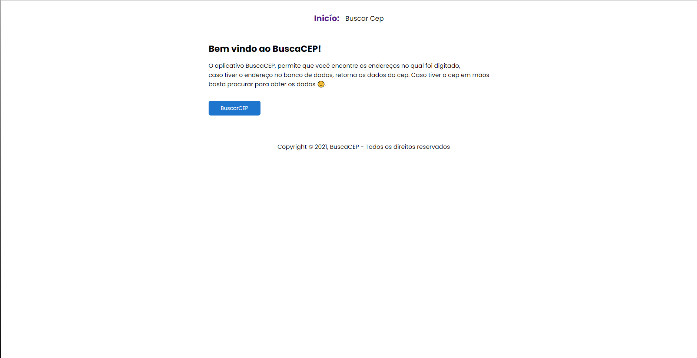
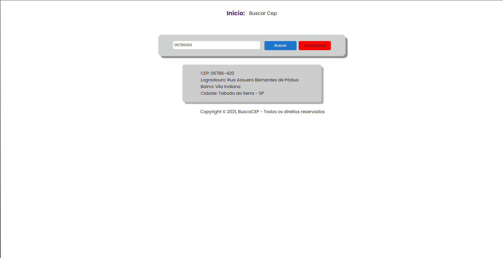

  <h1 align="center">Busca Cep</h1>

<!-- Getting Started -->
## INICIANDO O PROJETO

Para instalar o projeto em sua maquina siga os passos abaixo.

### INSTALAÇÃO

1. Clone o repositório

   ```sh
   git clone https://github.com/NiloMarcos/Busca-cep.git
   ```

2. Entre na pasta

   ```sh
   cd Busca-cep
   ```

3. Instale as dependências

   ```sh
   yarn
   ```

   ou

   ```sh
   npm i
   ```

  
  4. Rode o aplicação

    ```sh
    yarn start
    ```

### Fotos da aplicação
<section align="center">
  
      
</section>
